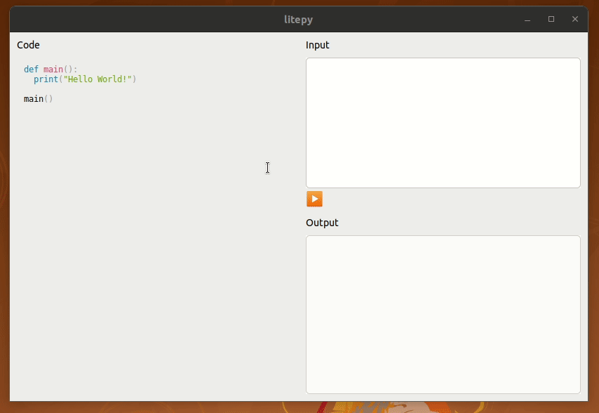
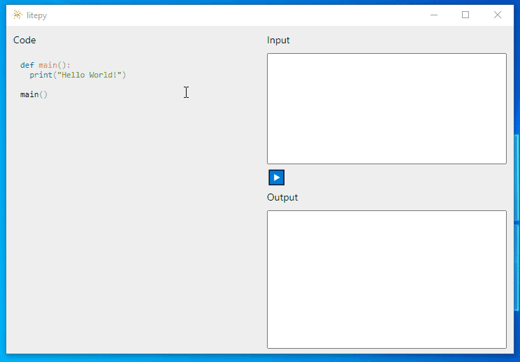
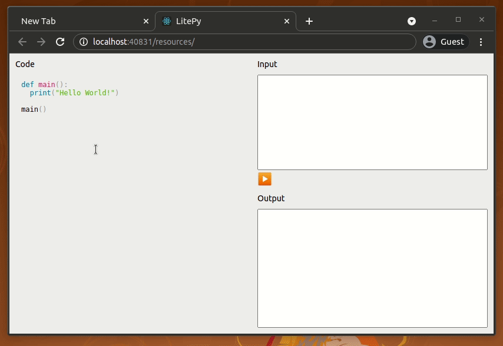

# litepy
World's simplest Python editor built with Neutralinojs

## on Linux


## on Windows


## on macOS
[Support](https://github.com/neutralinojs/v2-specification) Neutralinojs to release the v2 version for macOS.

## on Browser


# Developer Q & A

How to run the app?

```
 $ neu run
```

How to make a build of React code?

```
 $ cd liteman-rc
 $ yarn run build
```

*Note: If you are on Windows, please run the above command via Git Bash terminal.*

How to make binaries for the latest code?

```
 $ neu build
```

## License

[MIT](LICENSE)
Copyright (c) Shalitha Suranga

