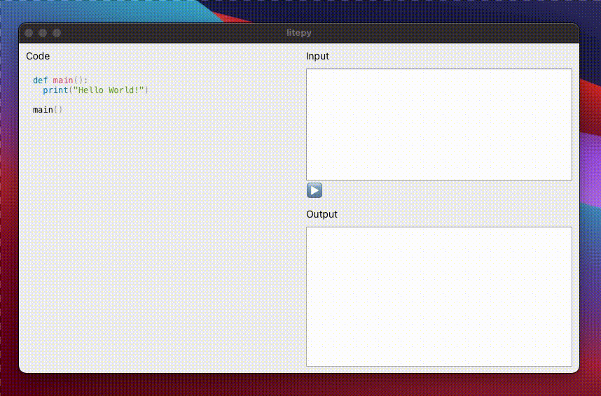

# litepy
World's simplest Python editor built with Neutralinojs

## on Linux


## on Windows


## on macOS


## on Browser


# Developer Q & A

How to run the app?

```
 $ neu run
```

How to generate app binaries?

```
 $ neu build
```

## License

[MIT](LICENSE)
Copyright (c) CodeZri.org

